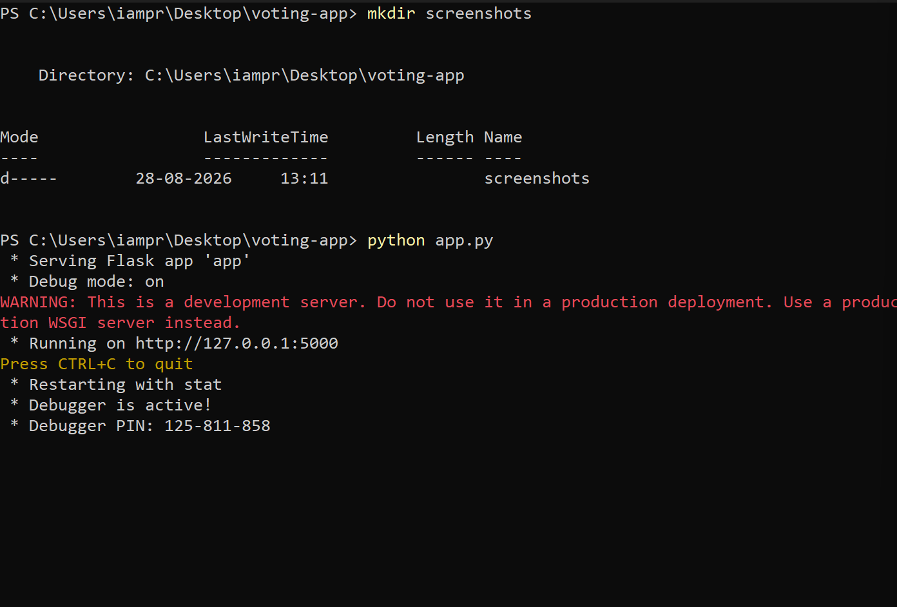
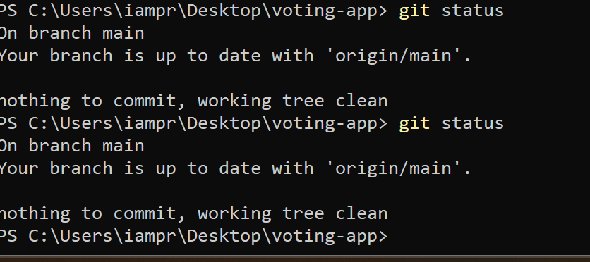
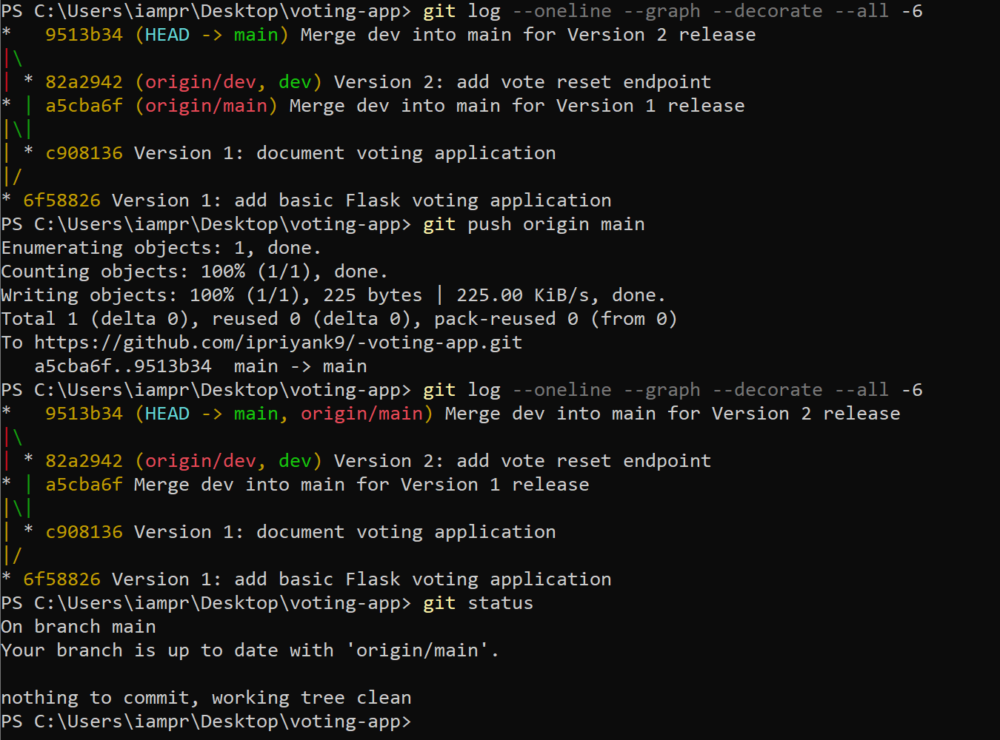

# Flask Voting Application

## Project Description

This project is a simple voting application that allows people to vote for candidates by visiting specific web addresses. It keeps track of the votes while the application is running and lets users view the current results. The application also provides a way to reset all votes. It can be run locally on a computer using Python.

## Installation and Setup

### Prerequisites

Make sure Python, Flask, and Git are installed on your computer.

### Clone the Repository

```bash
git clone <https://github.com/ipriyank9/-voting-app.git>
cd voting-app
```

### Install Flask

```bash
python -m pip install Flask
```

### Run the Application

```bash
python app.py
```

The application will start on:

```text
http://localhost:5000
```

Open the URL in a web browser to use the application.

## API Endpoint Reference

| Endpoint       | Method | Description                                                        | Example Response            |
| -------------- | ------ | ------------------------------------------------------------------ | --------------------------- |
| `/`            | GET    | Displays the welcome message.                                      | `Welcome to the App`        |
| `/health`      | GET    | Checks whether the application is running.                         | `App is running`            |
| `/vote/<name>` | GET    | Records one vote for the specified candidate.                      | `Vote recorded for Alice`   |
| `/results`     | GET    | Displays the current vote count for all candidates in JSON format. | `{"Alice": 2, "Bob": 1}`    |
| `/reset`       | GET    | Clears all stored votes and confirms that the reset was completed. | `All votes have been reset` |

### Example Requests

Vote for Alice:

```text
http://localhost:5000/vote/Alice
```

View results:

```text
http://localhost:5000/results
```

Reset all votes:

```text
http://localhost:5000/reset
```

After resetting the votes, `/results` should return:

```json
{}
```

## Git Workflow

This project uses two Git branches:

* `dev` - used for development and testing new features.
* `main` - contains stable, working versions of the application.

The development workflow was:

```text
Version 1 development
        |
        v
       dev
        |
        v
    Merge to main
        |
        v
   Version 1 release
        |
        v
Version 2 development
        |
        v
       dev
        |
        v
    Merge to main
        |
        v
   Version 2 release
```

All feature development was performed on the `dev` branch. After testing was completed, the changes were merged into `main`. This keeps `main` limited to stable versions of the application.

## Version History

| Version   | Changes                                                                                               |
| --------- | ----------------------------------------------------------------------------------------------------- |
| Version 1 | Created the Flask application, basic endpoints, voting functionality, and vote results functionality. |
| Version 2 | Added the `/reset` endpoint to clear all stored vote counts.                                          |

## Screenshots

### Application Running

The application running successfully in a web browser:



### GitHub Repository and Branches

The GitHub repository showing both `dev` and `main` branches:



### Git Commit and Merge History

The Git history showing Version 1 and Version 2 development and merges:


